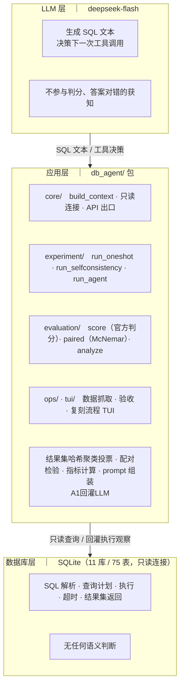
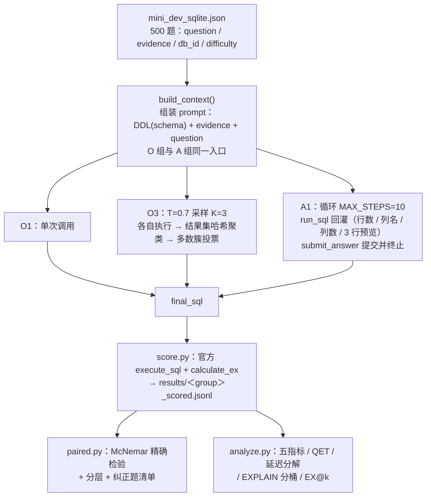

# 面向真实业务库的 Text2SQL：one-shot 与 Agent 闭环的对照研究

> **选题**：《数据库前沿技术》期末考核 A 卷　**选题方向**：方向 4（AI4DB）——Text2SQL / Database Agent
> **数据集**：BIRD Mini-Dev V1（SQLite）——500 题 / 11 库 / 75 表
> **模型**：`deepseek-flash`（DeepSeek-V4.1-Flash）
> **代码**：`db_agent/` 包，入口 `python -m db_agent <子命令>`

---

## 1. 问题定义与应用背景

### 1.1 已知问题

**在真实业务数据库上，把自然语言问题自动翻译成结果正确的 SQL**（Text2SQL）。
评测集BIRD Mini-Dev：11 个库、75 张表，题目横跨赛事统计
（`formula_1`）、医疗检验（`thrombosis_prediction`）、金融卡业务（`debit_card_specializing`）等，
需要多表连接、聚合、子查询与业务口径理解。

### 1.2 传统方法局限性

| 方案 | 局限 |
| --- | --- |
| 规则 / 模板 | 只能覆盖固定问法，无法处理开放表述与库结构变化 |
| 传统 Seq2Seq（如 IRNet 类） | 依赖大规模标注语料，且**生成时看不到执行结果**，无法自我纠正 |
| 单次 LLM 调用（one-shot） | 本任务实测可跑出 57.80%，但存在**系统性错误模式**：模型语义理解正确，输出形态包含冗余列，无法通过集合验证|

### 1.3 性能指标

| 指标 | 定义 | 备注 |
| --- | --- | --- |
| **EX** | `set(pred)==set(gold)`，官方 `evaluate_ex` 口径 | 执行准确率 |
| **Latency P50 / P95** | 端到端每题耗时（含 LLM 调用与 SQL 执行） | 长尾敏感度 |
| **QET（Query Execution Time）** | SQL的库执行耗时 | 纯SQL执行时间（不计入Latency） |
| **单题 token 成本** | 输入（含缓存命中）/ 输出 token | 模型开销 |

---

## 2. 数据库基础原理分析

### 2.1 查询计划与索引访问路径

**实测（可解析题数 / 占比）**：

| 组 | 可解析数 | SCAN(%) | SEARCH(%) | TEMP B-TREE(%) | COVERING INDEX(%) | 子查询(%) |
| --- | --- | --- | --- | --- | --- | --- |
| O1 | 491 | 473 (96.3%) | 379 (77.2%) | 190 (38.7%) | 34 (6.9%) | 81 (16.5%) |
| O3 | 495 | 483 (97.6%) | 382 (77.2%) | 195 (39.4%) | 32 (6.5%) | 83 (16.8%) |
| **A1** | 500 | 480 (**96.0%**) | 373 (74.6%) | 214 (**42.8%**) | 33 (6.6%) | 83 (16.6%) |

### 2.2 基数估计&结果集等价性

**项目方案**：O3 组的投票**使用执行结果集哈希对比代替SQL文本对比**。

**实测（O3 机制体检，`score.py:o3_mechanism_health`）**：

| 指标 | 值 | 含义 |
| --- | --- | --- |
| 三次候选 SQL 全同 | 115 (23.0%) | 采样未发散 |
| **执行结果集簇数 = 1** | **380 (76.0%)** | 候选SQL一致 |
| 结果集簇数 = 2 / 3 | 102 / 13 | 只有 **115 题 (23%)** 存在差异 |

### 2.3 执行代价&回灌

**项目方案**：通过A1 的 `run_sql` 工具（`experiment/tools.py`）进行限制：

| 限制 | 值 | 数据库意义 |
| --- | --- | --- |
| 返回行数上限 | `RESULT_ROW_LIMIT = 100` | 避免大结果集拖垮上下文 |
| 单条 SQL 执行超时 | `QUERY_TIMEOUT_SEC = 5` | 防止 agent 被慢查询挂死 |
| 工具返回值截断 | `TOOL_OUTPUT_MAX_CHARS = 2000` | 只回灌"**N 行，M 列（列名…）**+ 3 行预览" |

---

## 3. 试验设计与实现

### 3.1 代码结构



| 功能 | 实现来源 |
| --- | --- |
| SQL 生成、工具调用决策 | **LLM** |
| SQL 解析与执行、查询计划、结果集产出 | **数据库（SQLite）** |
| schema 拼装进 prompt（schema linking） | 应用层 |
| 结果集哈希聚类投票（O3）、迭代控制（A1） | 应用层 |
| EX 判分、列级召回、幻觉率、McNemar | 应用层（复用官方脚本） |
| 温度、`MAX_STEPS`、沙箱参数 | 应用层（`config.py` 单一事实源） |

### 3.2 数据流程



### 3.3 数据 Schema

**题目侧**（`data/mini_dev_sqlite.json`，500 条）字段：
`question_id` · `db_id` · `question`（自然语言问题）· `evidence`（领域提示，2 条缺失）·
`SQL`（gold，另存于 `mini_dev_sqlite_gold.sql`，制表符分隔 500 行）·
`difficulty`（simple 148 / moderate 250 / challenging 102）。

**库侧**（`data/dev_tables.json` + 11 个 SQLite 文件）：**11 库 / 75 表 / 1618 列**。

| 库 | 表 | 列 | | 库 | 表 | 列 |
| --- | --- | --- | --- | --- | --- | --- |
| formula_1 | 13 | 190 | | financial | 8 | 112 |
| superhero | 10 | 64 | | codebase_community | 8 | 144 |
| student_club | 8 | 98 | | european_football_2 | 7 | 400 |
| card_games | 6 | 232 | | debit_card_specializing | 5 | 44 |
| toxicology | 4 | 24 | | california_schools | 3 | 180 |
| thrombosis_prediction | 3 | 130 | | **合计** | **75** | **1618** |


### 3.4 存储与索引设计

| 项 | 做法 | 理由 |
| --- | --- | --- |
| 物理文件 | 沿用随数据集分发的 11 个 `.sqlite` | 属评测口径的一部分，改动会使 EX 不可比 |
| 索引 | **不新建、不删除** | 数据集未提供索引定义，评测以原始库为准 |
| 表结构 | **不改 DDL** | 同上 |
| 连接方式 | **只读** `file:...?mode=ro` | 防止实验过程污染数据 |
| 特例 | `card_games` 为 WAL 模式，只读打不开 → 回退 `immutable=1` | 存储引擎特性反向影响应用设计 |


### 3.5 查询流程

从最终答案到判分的**执行路径**：

```
final_sql
   │
   ├─► core/db.py: execute()
   │     · 只读连接按库缓存复用
   │     · fetchmany(100+1)  → RESULT_ROW_LIMIT=100（不遍历完整结果集）
   │     · 单条超时 QUERY_TIMEOUT_SEC = 5 s
   │     · 记录 QET（执行耗时）
   │
   ├─► 判分路径（离线，score.py）
   │     · 官方 execute_sql(pred, gold, db_path, "SQLite", calculate_ex)
   │     · func_timeout(30 s) 包裹；异常归类为 timeout / exec_error
   │     · calculate_ex  =  set(pred_res) == set(gold_res)
   │
   └─► agent 路径（在线，仅 A1）
         · 复用同一 execute()，但**只回灌**「N 行，M 列（列名…）」+ 3 行预览
         · 截断至 TOOL_OUTPUT_MAX_CHARS = 2000
         · 报错原样回灌，模型据此决定下一轮
```

### 3.6 三组的核心算法

| 试验组 | 算法 | 温度 | 工具 | 关键实现 |
| --- | --- | --- | --- | --- |
| `O1` | one-shot ×1 | 0.0 | — | `methods.run_oneshot` |
| `O3` | 采样 ×3 + **按执行结果集哈希聚类投票** | 0.7 | — | `methods.run_selfconsistency` |
| `A1` | agent 循环 + **输出形态自检** + `submit_answer` 终止 | 0.0 | `run_sql` | `methods.run_agent` |


### 3.7 关键实现要点

| 问题 | 后果 | 处理 |
| --- | --- | --- |
| 模型ReAct循环过长 | `final_sql` 采集失败 | 新增 `submit_answer` 终止动作 |
| 工具禁用导致模型输出畸形 | 45% 的 `final_sql` 不可执行 | `strip_tool_syntax()` + 取最后一条查询 |
| ReAct循环轮次不足 | 11/11 次提交都压在第 3 轮，9/20 未提交 | **安全护栏**（模型提交即停） |
| `question_id` 包含重复值 | 断点续跑漏跑 2 题，只得 498 条 | 改用 `qidx`（0..499 下标） |

---

## 4. 对照实验

### 4.1 实验方法

**n = 500，同一批题同一批次执行完毕后，逐题配对比较。**

**关于「Baseline」的口径说明。**
本项目的`O1`（plain LLM Text2SQL）与 `A1`（execution-guided）**逐字对应该示例的两侧**，
故 `O1` 即本子方向下的合法 Baseline。

### 4.2 Baseline 与主结果

**Baseline = `O1`（one-shot ×1）**，这是最朴素的 LLM 方案，也是"是否值得引入复杂度"的判据。

| 指标 | O1（Baseline） | O3 | **A1** |
| --- | --- | --- | --- |
| **EX** | 57.80% | 59.40% | **64.40%** |
| 简单（n=148） | 72.30% | 71.62% | **79.05%** |
| 中等（n=250） | 54.40% | 57.20% | **60.80%** |
| 困难（n=102） | 45.10% | 47.06% | **51.96%** |
| 列级召回 | 90.81% | 90.61% | 89.02% |
| 幻觉率 | 0.78% | 0.97% | **0.68%** |
| Latency P50 | 0.67 s | 2.02 s | 2.60 s |
| Latency P95 | 0.98 s | 2.76 s | **6.95 s** |
| QET P50 / P95 | 0.66 / 58.39 ms | 0.55 / 43.81 ms | 0.55 / 44.92 ms |
| `exec_error` | 9 | 5 | **0** |
| `timeout` | 2 | 2 | 2 |
| 调用 / 题 | 1.00 | 3.00 | 3.57 |
| 输出 token | 28,628 | 85,930 | 225,815 |

### 4.3 配对检验（McNemar 精确检验）

| 对比（后 − 前） | 净变化 | 仅前组对 | 仅后组对 | 不一致对 | p 值 | 结论 |
| --- | --- | --- | --- | --- | --- | --- |
| **O3 − O1** | +8 题（+1.60pt） | 5 | 13 | **18** | **0.0963** | **不显著** |
| **A1 − O1** | **+33 题（+6.60pt）** | 29 | 62 | 91 | **0.0007** | **显著** |
| **A1 − O3** | **+25 题（+5.00pt）** | 34 | 59 | 93 | **0.0124** | **显著** |

三条结论：
1. **A1 相对 O1 显著更优**：+6.60pt，p = 0.0007。
2. **O3 相对 O1 不显著**：+1.60pt，p = 0.0963，且**不一致对只有 18 题**——
   `paired.py` 会自行警告：这种规模下即便 p<0.05 也很脆弱。
3. **O3 显著劣于 A1**：O3 相对 A1 在**三档难度上全部为负**
   （simple −7.4pt / moderate −3.6pt / challenging −4.9pt）。

### 4.4 消融与敏感性实验

**项目方案**：利用 workload 的**固有分层**做敏感性分析，自变量是「查询复杂度 / Workload 结构」：

| 分层维度 | 分层依据 | 数据来源 |
| --- | --- | --- |
| **难度分层**（simple/moderate/challenging） | BIRD 官方标注，代表查询复杂度 | §4.2 表 |
| **gold 所需表数**（1/2/3/4–5 表） | 代表连接复杂度 | §5.3 |
| **EXPLAIN 访问路径分桶** | 代表物理执行复杂度 | §2.1 |

基本结论：**难度分层给出的差异很小（各档 Δpt 都在 ±7pt 内），而按表数分层给出的差异极大**（1 表 EX 81.4% → 3 表 EX 47.1%）。


### 4.5 代价对照

| | O1 | O3 | A1 |
| --- | --- | --- | --- |
| 调用次数（总计） | 500 | 1,500 | **1,783** |
| 其中 `run_sql` / `submit_answer` | — | — | 1,768 / 497 |
| 输入 token（含缓存） | 488,730 | 1,466,190 | 3,894,598 |
| 其中缓存命中 | 393,009 | 1,179,027 | 3,522,436 |
| **缓存命中率** | 80.4% | 80.4% | **90.4%** |
| 缓存未命中输入 | 95,721 | 287,163 | 372,162 |
| 输出 token | 28,628 | 85,930 | 225,815 |

**延迟分解**（长尾归因的前提）：

| 组 | Σ总延迟 (s) | Σcall_latency | ΣQET | Σ调度开销 | 单次调用 P50 / P95 | 调用次数 |
| --- | --- | --- | --- | --- | --- | --- |
| O1 | 344 | 344 | 0 | 0 | 0.67 / 0.98 | 500 |
| O3 | 1058 | 1014 | 0 | 44 | 0.66 / 0.97 | 1500 |
| A1 | 1558 | 1513 | 19 | 27 | 0.82 / 1.25 | 1783 |

### 4.6 可靠性验证

**噪声底**：

| 同配置重跑 | EX 变化 | 翻盘题 | 净翻转 |
| --- | --- | --- | --- |
| O1 自身 | −0.60pt | 15 (3.0%) | −3 |
| A1 自身 | +1.00pt | 21 (4.2%) | +5 |
| **→ 噪声底** | **±1pt** | 3~4% | ±3~5 题 |
| **→ 处理效应（A1 − O1）** | **+6.60pt** | 18.2% | **+33 题** |

### 4.7 EX@k 曲线（成本-收益）

| k | O1 累计 EX@k | O3 累计 EX@k | A1 累计 EX@k |
| --- | --- | --- | --- |
| 1 | 57.80% (+289) | 58.20% (+291) | 23.80% (+119) |
| 2 | — | 62.80% (+23) | 47.40% (+118) |
| 3 | — | **64.20% (+7)** | 58.80% (+57) |
| 4 | — | — | 63.00% (+21) |
| 5 | — | — | **64.40% (+7)** |
| 6 | — | — | 64.80% (+2) |
| 7 | — | — | 65.00% (+1) |
| 8 | — | — | 65.20% (+1) |
| 9 | — | — | 65.60% (+2) |
| 10 | — | — | 65.60% (+0) |

---

## 5. 结果分析与失败案例

### 5.1 失败案例：O3 未显著优于基准，且显著劣于 A1

| 结论 | 数据 |
| --- | --- |
| O3 相对 O1 的提升 | +1.60pt，**p = 0.0963，不显著** |
| 不一致规模 | **仅 18 题** |
| O3 相对 A1 | **−5.00pt，p = 0.0124，显著劣于** |
| 三档难度 | 全部为负（simple −7.4 / moderate −3.6 / challenging −4.9） |

### 5.2 机制归因

| 指标 | 值 | 含义 |
| --- | --- | --- |
| 三次候选 **SQL 全同** | 115 (23.0%) | 采样根本没发散 |
| 候选有差异 | 385 (77.0%) | 采样确实在发散 |
| **执行结果集簇数 = 1** | **380 (76.0%)** | **三候选答案完全相同** |
| 结果集簇数 = 2 / 3 | 102 / 13 | 只有 **115 题（23%）** 存在分歧 |
| 候选全失败退回 | 5 题 | 采集兜底，须披露 |
| 候选执行结果 | ok 1462 / timeout 4 / OperationalError 34 | **2.5% 的候选未跑出结果** |

**机制**：

| 考查维度 | 本项目的位置 |
| --- | --- |
| **Workload Dependency** | 投票价值高度依赖 workload 的"多解性"。BIRD 多数问题有唯一正确答案且输出形态唯一 |
| **Data Distribution** | 见 §5.3——增益随"所需连接表数"急剧衰减：1 表 EX 81.4% → 3 表 47.1%，且 A1 在 3 表题上零改进 |
| **Model Generalization** | 即便 T=0.7，`deepseek-flash` 关闭思考模式后采样多样性有限（23% 的题连 SQL 文本都全同 |
| **Cost Trade-off** | 见 §4.5 / §4.7——O3 花 3 倍 token 换不显著的 +1.60pt；A1 花 8 倍 token 换 +6.60pt；A1 的边际收益在 k=5 后迅速衰减 |
| **Tail Latency** | 见 §4.5 延迟分解——端到端 P95 涨 7 倍，但单次调用 P95 仅 0.98→1.25 s，长尾现象主要来自ReAct轮数|

### 5.3 具体失败案例

数据目录 `results/repro3/` 完整保存了纠正清单。

- **q70**（simple / `student_club`，A1 用了 2 轮）
  - 问：State the category of events were held at MU 215.
  - **A1 SQL**：`SELECT DISTINCT type FROM event WHERE location = 'MU 215'`
  - gold：`SELECT DISTINCT T2.category FROM event AS T1 INNER JOIN budget AS T2 ON T1.event_id = T2.link_to_event WHERE T1.location = 'MU 215'`
  - **失败归因**：典型**漏表**——`category` 在 `budget` 表而非 `event` 表。
    A1 执行成功（`type` 列存在），执行反馈**无法暴露这个语义错误**，与 §5.4 一致。

- **q105**（moderate / `thrombosis_prediction`，A1 用了 6 轮）
  - 问：What is the average age of the male patient with high cholesterol?
  - **A1 SQL**：用了 `p.ID IN (SELECT ID FROM Laboratory WHERE \`T-CHO\` >= 250)` 子查询
  - gold：`INNER JOIN Laboratory` 后 `WHERE ... AND T1.SEX = 'M'`
  - **失败归因**：两种写法在多数数据上可能等价，但本题结果不一致 → 属"值/逻辑错"（35.4% 档）。

**纠正**的代表案例（说明形态自检的直接效果）：

- **q1**（moderate / `debit_card_specializing`，4 轮）：问"2012 年 LAM 消费最少的是谁"。
  A1 只返回 `c.CustomerID` 一列（形态正确），而 O1 多带了合计列 → 被集合比较判错。

---

## 6. 前沿性与局限性分析

### 6.1 对比论文

**论文 A：DAIL-SQL（PVLDB 2024）**
Gao et al., *Text-to-SQL Empowered by Large Language Models: A Benchmark Evaluation*,
**PVLDB 17(5): 1132–1145, 2024**. 系统评测了 LLM 在 Text2SQL 上的 prompt 工程路线，
核心贡献在 **schema 表示**（DDL 压缩、M-Schema）与**示例选择**（DAIL Selection）。
代表"不训练、纯 prompt 侧优化"这一路线。

**论文 B：Reward-SQL（SIGMOD 2026）**
Zhang et al., *Reward-SQL: Boosting Text-to-SQL via Stepwise Execution-Aware Reasoning and
Process-Supervised Rewards*, **PACMMOD 4(3), Article 228（SIGMOD）, 2026**,
DOI `10.1145/3802105`（arXiv:2505.04671）。提出 **CoCTE** 分治式执行感知推理：
把复杂查询拆成一系列**可执行**的 CTE，每步**即时执行**以获取步骤级反馈；
再用**过程奖励（PRM）+ RL** 训练。BIRD 上以 **8B 模型达 70.3% EX**，
相比 Qwen3-8B GRPO 基线把表选择错误降低 42.6%、GROUP BY 错误降低 82.4%。

### 6.2 项目现状

**（1）项目成果**

| 参照 | Mini-Dev / BIRD 上的 EX |
| --- | --- |
| 官方 Mini-Dev 基线 gpt-4（SQLite EX） | 47.80 |
| 官方 Mini-Dev 基线 TA + gpt-4-turbo | 58.00 |
| 官方 Mini-Dev 基线 TA + gpt-4o | **63.00** |
| **本项目 O1（Baseline）** | **57.80** |
| **本项目 A1** | **64.40** |
| Reward-SQL（8B，RL 精调，BIRD） | **70.30** |
| XiYan-SQL（BIRD dev，需微调） | 73.34 |

**结论**：本项目用**冻结的 API 模型、零训练**，A1 达到 64.40%，
略高于官方 Mini-Dev 最强基线 TA+gpt-4o（63.00）。但与需要**微调生成器 + 微调选择模型/RL**
的 SOTA 系统（70.3~73.3）仍有 **6~9pt** 差距——**这 6~9pt 差距基本等于"训练"的价值**。

**（2）前沿差距**

| 维度 | 本项目 | DAIL-SQL / Reward-SQL |
| --- | --- | --- |
| 模型 | 冻结 API，零训练 | 微调生成器 + 选择模型 / RL 训练 |
| 反馈使用 | 只回灌列数据 | 步骤级可执行反馈 + **过程奖励**做信用分配 |
| 候选重排 | 无选择模型 | 独立选择模型 / PRM 打分 |
| Schema 表示 | raw DDL 直塞 prompt，无 schema linking | M-Schema + schema linking（业证 +4pt 量级） |
| 样本量 | 500 题 / 单模型 / 单库族（SQLite） | 全量 BIRD + 多方言 |

**（3）结论局限性**

- **O3 的"零增益"难以推广到有 RL 精调的场景**。本项目的 O3 是
  "无选择模型 + 冻结采样"的投票，Reward-SQL 这一类工作恰恰证明：
  加上**过程奖励与选择模型**后，多候选的价值可以被释放出来。
- **SQLite-only 的局限性**：SQLite 只有 B-tree、无原生 Hash 索引。
- **单模型单数据集**：所有结论只对 `deepseek-flash` + Mini-Dev 成立。

---

## 7. 报告规范与可复现性

### 7.1 源代码

```
db_agent/
├── cli.py              子命令分发表
├── config.py           单一事实源：模型/路径/温度/MAX_STEPS/沙箱参数
├── core/               data(加载+build_context) · db(唯一执行入口) · llm(唯一 API 出口) · metrics
├── experiment/         run · methods(O1/O3/A1) · prompts · tools
├── evaluation/         score(官方判分) · paired(McNemar) · analyze(离线分析)
├── ops/                fetch_data · gate0/1/2_check
└── tui/                repro_tui(9 步复刻流程)
```

### 7.2 数据说明

| 项 | 值 |
| --- | --- |
| 数据集 | BIRD **Mini-Dev V1**，SQLite 版 |
| 规模 | **500 题 / 11 库 / 75 表** |
| 难度分布 | simple 148 / moderate 250 / challenging 102 |
| gold 格式 | `mini_dev_sqlite_gold.sql`，制表符分隔，500 行，与题目逐条对齐 |
| 缺失项 | **2 条 evidence 缺失**（qidx 18 / 26，`debit_card_specializing`） |

### 7.3 运行方式

**推荐使用TUI**：`your_env/python -m db_agent tui`，
把「验收 → 跑组 → 判分 → 配对/分析」串成 9 步（`d` 执行、`r` 刷新、`s` 停止、`q` 退出）。

**手动复现步骤**

**逐条手动等价命令**：

| TUI 步骤 | 手动等价命令 | 产物 / 状态判据 |
| --- | --- | --- |
| 1 环境 | （无需命令，`check` 会一并报出） | 5 个直接依赖齐全 |
| 2 密钥 | `$P -m db_agent set-key`（密钥从 stdin 读入，见 `README.md`） | `.env` 可读到密钥 |
| 3 Gate 0 | `$P -m db_agent gate 0` | `results/env.json` |
| 4 数据 | `$P -m db_agent fetch` | `data/dev_databases/`（11 库） |
| 5 Gate 1 | `$P -m db_agent gate 1` | 离线，约 15 s |
| 6 Gate 2 | `$P -m db_agent gate 2 --offline` | 离线测试 |
| 7 跑组 | `$P -m db_agent run --group O1`（O3 / A1 同法） | `results/<group>.jsonl`|
| 8 判分 | `$P -m db_agent score --group O1`（O3 / A1 同法） | `results/<group>_scored.jsonl`，离线 |
| 9 配对 / 分析 | `$P -m db_agent pair <A_scored> <B_scored>`<br>`$P -m db_agent analyze --out results/analyze.md` | `pair` 输出到 stdout（TUI 版落盘为 `results/.tui/paired_*.txt`）；`results/analyze.md`，均离线 |

### 7.4 实验配置

| 参数 | 值 |
| --- | --- |
| Python | 3.12.14 |
| SQLite | 3.53.4 |
| 模型 | `deepseek-flash`（DeepSeek-V4.1-Flash） |
| 思考模式 | **disabled** |
| 温度 | O1/A1 = 0.0；**O3 = 0.7**（机制内在要求） |
| K（O3 采样数） | 3 |
| `MAX_STEPS`（A1） | 10（**安全护栏**，非实验变量；实测均值 3.57 轮） |
| 依赖 | 见 `README.md` §依赖清单（openai 3.16.2 / sqlglot 30.18.0 / tqdm / python-dotenv 等） |

### 7.5 核心实验原始结果

**`results/repro3/`——三组同批次的完整轨迹与判分产物**（本项目主结果的唯一数据来源）：

| 文件 | 说明 |
| --- | --- |
| `O1.jsonl` / `O3.jsonl` / `A1.jsonl` | 原始轨迹：每轮 `turns`、工具调用、token 分项、每轮 `call_latency` |
| `O1_scored.jsonl` / `O3_scored.jsonl` / `A1_scored.jsonl` | 判分产物：官方 EX + 列级召回 + 幻觉率 + EX@k |
| `env.json` | 运行环境落盘（见 §7.4） |
| `README.md` | 本批次说明 + sha256 清单 + 复算命令 |