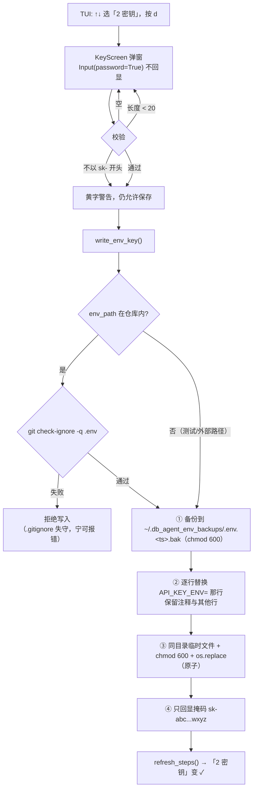

# .env 密钥录入（TUI 内输入 API Key）

## Context

用户要求在复刻流程里补上 `.env` 配置：让使用者在 TUI 里直接输入 `DEEPSEEK_API_KEY`，
而不是被要求手工 `cp .env.example .env` 再编辑。

当前盘面（实测）：

| 项 | 状态 |
| --- | --- |
| `.env` | **不存在** → `--check` 显示 `✗ 2 密钥 .env 缺 DEEPSEEK_API_KEY` |
| `data/dev_databases/` | 已删除（用户重置成干净起点） |
| `~/Downloads/minidev.zip` | 已被 `fetch_data.py` 清理删除 |
| `~/Downloads/minidev/` | 3.3 G 解压残留仍在（不在本次范围） |
| 系统环境变量 `DEEPSEEK_API_KEY` | **未导出**（所以 `.env` 是唯一来源，写它就会生效） |

### 两个决定设计的安全事实（已实测）

1. **`.env.bak*` 不被 `.gitignore` 覆盖**：

   ```
   .env                  .gitignore:2:.env         ✅ 已忽略
   .env.bak              !! NOT IGNORED            ← 含密钥的备份会被 git add .
   .env.bak.20260924     !! NOT IGNORED
   .env_backups/x        !! NOT IGNORED
   ```

   → **备份必须落在仓库之外**，否则一次 `git add .` 就把真密钥提交进历史，删不掉。

2. **`config._load_env()` 用 `override=False`**，即系统环境变量优先。若使用者已
   `export DEEPSEEK_API_KEY=...`，写 `.env` **不会生效**（子进程也继承那个旧值）。
   → 弹窗必须就此告警，否则会出现"我明明填了密钥却还是报密钥错"的鬼故事。

## 整体架构 / 流程



## 改动清单

### 1. `write_env_key(key, env_path=None, backup_dir=None)` —— 纯文件逻辑，可单测

| 行为 | 细节 |
| --- | --- |
| 默认路径 | `env_path = ROOT/.env`；`backup_dir = ~/.db_agent_env_backups` |
| **gitignore 守卫** | `env_path` 位于 `ROOT` 内时，先 `git check-ignore -q .env`；不通过则**拒绝写入**并报错 |
| 备份 | 文件已存在时复制到 `backup_dir/{name}.{YYYYmmddHHMMSS}.bak`，并 `chmod 600`（备份同样含密钥） |
| 内容更新 | 逐行扫描：命中 `API_KEY_ENV=` 则替换该行，**保留注释与其他行**；未命中则追加 |
| 原子落盘 | 同目录 `.<name>.tmp` 写入 → `chmod 600` → `os.replace` |
| 返回值 | `(ok, message, backup_path)`；**message 只含掩码，永不含明文密钥** |

### 2. `KeyScreen(ModalScreen)` —— 密码输入弹窗

- `Input(password=True)`：输入以圆点回显，**屏幕上看不到明文**
- 按钮「保存」/「取消」，`enter` 提交、`escape` 取消
- 校验：空 / 长度 < 20 → 红字提示且不关闭；不以 `sk-` 开头 → 黄字警告但允许保存
  （密钥格式可能变，不做硬拦截）
- 若 `os.environ` 已有同名变量 → 弹窗内显式告警「系统环境变量优先，写 .env 不会生效」

### 3. 接线

| 位置 | 改动 |
| --- | --- |
| `STEPS` 里 `secret` | `runnable=False` → `True` |
| `run_step()` | `key == "secret"` 特判：打开 `KeyScreen`，不走子进程、不写台账 |
| `explain("secret")` | 改成说明"按 d 打开输入框" |
| `build_job()` | `secret` 仍返回 `[]`（它没有外部命令） |

### 4. CLI（无终端场景 + 让本功能可被安全测试）

```bash
# 从 stdin 读，绝不用 argv —— 避免密钥进 shell history / ps 输出
printf 'sk-xxxxxxxx' | python repro_tui.py --set-key

# 指定落点（默认 ROOT/.env）；用于测试或备用配置
printf 'sk-xxxxxxxx' | python repro_tui.py --set-key --env-path /tmp/x/.env
```

## 主要改动文件

| 文件 | 改动 |
| --- | --- |
| `repro_tui.py` | 修改：新增 `write_env_key` / `yuan` 旁的工具、`KeyScreen`，接线 secret 步骤与 CLI 分支 |
| `plan/env-key-plan.md` | 本计划文件 |

不改动 `config.py`（读取逻辑已经是"系统环境变量优先、否则读 .env"，无需改）、
不改动 `gate0_check.py`、不改动 `.gitignore`（改用"备份放仓库外"从根上规避）。

## 验证

| # | 谁 | 命令 / 动作 | 期望 |
| --- | --- | --- | --- |
| 1 | 我 | `python -m py_compile repro_tui.py` | 通过 |
| 2 | 我 | 无头测试：挂载 `KeyScreen`，模拟输入并保存到 **`/tmp/.../.env`**（**绝不碰真实 `.env`**） | 文件生成、权限 `600`、内容只含 `DEEPSEEK_API_KEY=…` |
| 3 | 我 | 无头测试：对已有内容的临时 `.env`（含注释 + 一个别的变量）再写一次 | **注释与其他行保留**，只有 key 行被替换；备份出现在临时 `backup_dir` |
| 4 | 我 | 无头测试：`env_path` 落在仓库内且 `.gitignore` 正常 | 通过守卫；用假 gitignore 场景确认**不通过时拒绝写入** |
| 5 | 我 | `printf 'sk-test...' \| python repro_tui.py --set-key --env-path /tmp/x/.env` | 只打印掩码，不打印明文 |
| 6 | 我 | `python repro_tui.py --check` | 真 `.env` **仍不存在**（证明测试没污染真实配置），密钥步骤仍为 `✗` |
| 7 | **你** | TUI 里选「2 密钥」按 `d` → 粘贴密钥 → 保存 | 状态变 `✓`，日志只出现掩码；`ls -l .env` 是 `-rw-------` |
| 8 | **你** | 接着跑「Gate 0」 | 真实 API 校验通过（这一步才真正证明密钥可用） |

> 第 2–5 项全部在 `/tmp` 下进行，**不会创建或覆盖 `ROOT/.env`** —— 这条是硬约束，
> 因为真实密钥一旦被我写坏，你就要重新申请。

## 明确不做（后续再说）

- **不做密钥有效性联网校验**（不在录入时偷偷发请求）：校验交给现成的 Gate 0 步骤，
  职责分离，也避免"输入即产生网络请求"的意外。
- **不写 `.env` 以外的配置项**：`BASE_URL` / `MODEL` / 温度都在 `config.py`，
  按项目"单一事实源"原则，`.env` 只放密钥。
- **不把密钥缓存到内存或台账**：`results/.tui/state.json` 只记退出码与命令。
- **不做多密钥/多 provider 管理**、不做系统 keychain 集成。
- **不删除 `~/Downloads/minidev/`（3.3 G 残留）**：与本需求无关，需要时单独确认。
