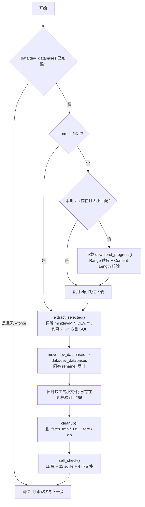

# fetch_data.py · 数据集一键获取与摆正

## Context

仓库 clone 后缺 `data/dev_databases/`（1.4 G，被 `.gitignore` 屏蔽），README 要求人工
下载 → 解压 → 手工 `cp` 四个路径 → 再删残留。手工流程有三个已知痛点：

1. **易摆错层级**：zip 解压后多一层 `minidev/MINIDEV/`，README 说手册写的 `mini_dev_data/` 是错的。
2. **无谓搬运 2 GB**：`minidev/MINIDEV_mysql/BIRD_dev.sql`（995 M）与
   `minidev/MINIDEV_postgresql/BIRD_dev.sql`（955 M）本项目完全不用。
3. **无进度、不可续传**：764 MiB 单次 `curl`，断了从头再来。

被证据固定的前提（本机实测）：

| 事实 | 值 |
| --- | --- |
| zip 顶层结构 | **只有 `minidev/` 一个顶层目录，共 122 条目**（已验证 central directory） |
| zip 体积 | **800,943,648 B = 764 MiB**（本机 `~/Downloads/minidev.zip` 已是此大小） |
| SQLite 源目录 | `minidev/MINIDEV/` |
| 目标目录 | `data/dev_databases/`（**必须直接躺在 `data/` 下**，`config.DB_DIR` 写死） |
| 库数量 | 11 个目录，每个含一个 `<db_id>.sqlite` |
| 已版本化的 4 个小文件 | `mini_dev_sqlite.json` / `_gold.sql` / `.jsonl` / `dev_tables.json`（clone 即有，且与 zip 内逐字节相同） |
| 磁盘余量 | 242 GiB（足够，无需分区检查阻断） |

约束：新增脚本**不得修改任何既有文件**（只 import `config` 读路径，不写 `config.py`）；
删除操作必须严格限定在脚本自己创建的临时目录与 zip 上。

## 整体架构 / 流程



### 关键设计

| 设计 | 理由 |
| --- | --- |
| **选择性解压**：只解 `minidev/MINIDEV/**` 前缀的条目 | 两个方言 SQL 共 1.95 GB **根本不落盘**，直接省掉"下载后删除"这一步 |
| **先解到 `data/.fetch_tmp/` 再 rename** | 目标目录不会出现半成品；同卷 `os.replace` 是瞬时操作，不额外占 1.4 G |
| **下载用标准库 `urllib` + `tqdm` 字节进度条** | 不引入新依赖（`tqdm` 已是项目依赖）；支持 `Range` 续传 |
| **不覆盖既有小文件** | 那 4 个文件已版本化且与 zip 内**逐字节相同**（sha256 已核对），只在缺失时补 |
| **删除白名单** | 只允许删 `data/.fetch_tmp`、`data/dev_databases/.DS_Store`、`--zip` 指定文件 |

## 改动清单

### 唯一新增文件：`fetch_data.py`（仓库根目录）

| 函数 | 职责 |
| --- | --- |
| `download(url, dest, expected_bytes)` | 有本地完整文件则跳过；有残片则 `Range` 续传；分块 1 MiB 写入 + `tqdm` 字节条 + 完成后比对总大小 |
| `extract_selected(zip_path, tmp_root)` | 手写逐成员解压（不用 `extractall`），只收 `minidev/MINIDEV/` 前缀；重写目标路径为 `tmp_root/<MINIDEV 之后的相对路径>`；内含 **zip-slip 防护**（拒绝绝对路径与 `..`）；`tqdm` 按未压缩字节推进 |
| `locate_source(root)` | 从解压根定位 `dev_databases/` 与三个 json/gold，兼容"多一层 / 少一层" |
| `install(source_dir)` | `dev_databases` rename 到 `data/`；4 个小文件缺失才补，存在则比对 sha256 并提示 |
| `cleanup(paths)` | 白名单校验后删除临时目录、`.DS_Store`、（默认）zip |
| `self_check()` | 校验 11 个库目录、11 个 `.sqlite`、4 个小文件齐全 |
| `main()` | `argparse` 入口 + 磁盘余量提示 + 中文分步日志 |

CLI：

```bash
python fetch_data.py                                  # 全自动：复用/下载 → 解压 → 摆正 → 清理
python fetch_data.py --from-dir ~/Downloads/minidev    # 用已解压目录，跳过下载与解压
python fetch_data.py --keep-zip                        # 保留 zip
python fetch_data.py --force                           # 目标已存在时重建
python fetch_data.py --url <URL> --zip <PATH>          # 覆盖源与落点
```

默认值：`--url https://bird-bench.oss-cn-beijing.aliyuncs.com/minidev.zip`、
`--zip ~/Downloads/minidev.zip`、`--expected-bytes 800943648`（本机实测值，用于本地 zip 复用判定）。

## 主要改动文件

| 文件 | 改动 |
| --- | --- |
| `fetch_data.py` | **新增**（约 230 行），不改动任何既有文件 |
| `plan/fetch-data-plan.md` | 本计划文件 |

不改动：`config.py`、`data.py`、`gate1_check.py`、`README.md`（只被 import / 被引用）。

## 验证

脚本自带 `self_check()` 兜底；完整验收按下表逐条执行（**均由你执行或授权我在后台跑**）：

| # | 命令 | 期望现象 |
| --- | --- | --- |
| 1 | `python fetch_data.py --from-dir ~/Downloads/minidev` | 跳过下载；打印"选择性解压 N 个条目"；结尾自检 `11 库 / 11 sqlite / 4 小文件 ✅` |
| 2 | `ls data/dev_databases \| wc -l` | `11` |
| 3 | `ls data/dev_databases/*/*.sqlite \| wc -l` | `11` |
| 4 | `ls -d data/dev_databases/*_mysql data/dev_databases/*_postgresql 2>/dev/null` | 无输出（方言 SQL 从未落盘） |
| 5 | `du -sh data/dev_databases` | 约 `1.4G` |
| 6 | `git status --short` | 只看到 `?? fetch_data.py`、`?? plan/`；**看不到** `data/dev_databases`（被 ignore） |
| 7 | `python gate1_check.py; echo exit=$?` | 全部 PASS，`exit=0` |
| 8 | 幂等性：再跑一次脚本 | 打印"目标已完整，跳过"，不重复下载解压 |

重复运行安全性：目标完整时直接跳过；`--force` 才会重建。已核对的边界：本地 zip 大小
不符则按残片走 `Range` 续传，服务端不支持 `Range`（返回 200 而非 206）时自动退回整文件重下。

> ⚠️ 第 1 步的"真下载"路径（764 MiB）**预计远超 8 秒**，按执行规范我不自行放行；
> 若你要我跑真下载，我会用后台任务启动并把 job 输出回报给你。

## 明确不做（后续再说）

- **不做断点校验 sha256 全量比对**：官方未提供 checksum；靠 `Content-Length` 校验 +
  `zipfile` 解压期的 CRC 自校验（`BadZipFile` 即失败）已足够。
- **不做多线程/多连接下载**：OSS 单连接已够快，复杂度不值。
- **不碰 `reference/`**：官方评测脚本已随仓库提交，无需再 clone `bird-bench/mini_dev`。
- **不生成 `mini_dev_sqlite.jsonl`**：仓库已含（500 行，带 `qidx`），无需按 README 的片段重建。
- **不改 `README.md`**：README 里"O3 未跑全量"是过期描述（实际已全量跑完，见 `实验结论.md` §2），
  但修文档不属于本次需求，另行处理。
- **不写 `requirements.txt` / CI**：本次只加一个数据获取脚本。
