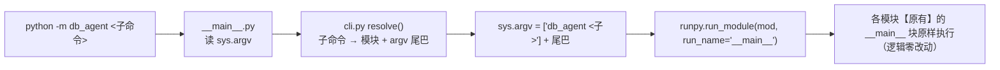

# 统一入口：python -m db_agent <子命令>

## ★ 决策变更（2026-09-24，第二次）

| | 方案 A（已实施，现撤销） | **方案 B（本次，用户改选）** |
| --- | --- | --- |
| 入口 | 根目录 9 个薄入口 | `python -m db_agent <子命令>` |
| 根目录 .py | 9 个（各 6 行） | **0 个** |
| 文档命令 | 不用改 | **22 行**要改 |
| `repro_tui` 子进程 | 不用改 | 9 处要改 |
| `git log --follow` | 7 个文件**断裂**（薄入口占用原路径，无法配对成 rename） | **16 个全部干净 rename** ✅ |
| 其他 cwd 可运行 | ✅（shim 靠 sys.path[0]） | ❌ 需在仓库根，或 `PYTHONPATH`/`pip install -e .` |

**B 顺带修掉了 A 的历史断层问题** —— 这是本次改选的额外收益，已实测确认
（未跟踪的薄入口删除后，原本被占用的 7 个原路径变为"已删除"，git 即可配对）。

## Context

搬迁与 import 改写**已完成并验证通过**（19 模块导入 OK / gate1 21-21 / gate2 42-42 /
TUI `--check` 逐字一致 / 内容差异审计 42 行全是 import 与路径）。本次只做**入口统一**
与随之而来的命令引用同步，**不动任何实验逻辑，不再搬迁文件**。

## 整体架构 / 流程



**为什么用 runpy 而不是 import main()**：`gate2_check.py` 用 `"--offline" in sys.argv`
判模式、`paired.py` 用 `main(*sys.argv[1:3])` 取参、缺参时还靠 `__doc__` 打印用法。
runpy 让这些模块的 `__main__` 块**原样跑**，是唯一能做到零逻辑改动的方式。

## 改动清单

### 1. 新增 `db_agent/cli.py`（约 70 行）

```python
SUBCOMMANDS = {
    "fetch":   "db_agent.ops.fetch_data",
    "run":     "db_agent.experiment.run",
    "score":   "db_agent.evaluation.score",
    "pair":    "db_agent.evaluation.paired",
    "analyze": "db_agent.evaluation.analyze",
    "tui":     "db_agent.tui.repro_tui",       # argv 尾巴 []
    "check":   "db_agent.tui.repro_tui",       # 尾巴 ["--check"]
    "set-key": "db_agent.tui.repro_tui",       # 尾巴 ["--set-key", *rest]
}
# gate 特殊：gate {0|1|2} [--offline]  → db_agent.ops.gate{0,1,2}_check
```

`resolve(argv) -> (module, argv_tail)`；`-h/--help` 或无参时打印子命令表。

### 2. 新增 `db_agent/__main__.py`（约 12 行）

```python
import runpy, sys
from db_agent.cli import resolve
mod, tail = resolve(sys.argv[1:])       # 解析失败 → SystemExit(帮助)
sys.argv = [f"db_agent {sys.argv[1] if len(sys.argv) > 1 else ''}", *tail]
runpy.run_module(mod, run_name="__main__")
```

### 3. 删除根目录 9 个薄入口

`run.py score.py paired.py analyze.py gate0_check.py gate1_check.py gate2_check.py
fetch_data.py repro_tui.py` → 全部删除。

### 4. 代码内命令/文案同步（4 类，全部已定位到行）

| 位置 | 内容 |
| --- | --- |
| `tui/repro_tui.py` 364/366/368/370/375/381/385/387 | 9 处子进程命令 `[PY, "run.py", …]` → `[PY, "-m", "db_agent", "run", …]` |
| `tui/repro_tui.py` 4-5、884、896-897、302 | docstring 用法块、`set-key` 用法提示、非 tty 提示里的脚本名列表、`"跑 fetch_data.py"` |
| `ops/fetch_data.py` 271 | `print(f"  {sys.executable} gate1_check.py")` → `python -m db_agent gate 1` |
| 各模块 docstring 用法示例 | `paired.py:4`（**它缺参时就打印这段**）、`score.py:3`、`analyze.py:3-5`、`run.py:3-4`、`gate0/1/2_check.py` 头部"运行："注释 |

### 5. 文档命令改写（22 行；散文里的模块名保留）

| 文档 | 行号 | 处数 |
| --- | --- | --- |
| `README.md` | 172, 344, 347, 366, 374, 387, 388, 394, 402, 403, 404 | 11 |
| `实验结论.md` | 72, 73, 74 | 3 |
| `docs/doc.md` | 898, 921, 922, 950, 951, 981, 1252, 1253 | 8 |
| `docs/阶段8产出.md` | —（只有散文提及） | 0 |

**映射**：`X.py [args]` → `-m db_agent <子> [args]`；`gate{N}_check.py [--offline]` →
`gate N [--offline]`；`repro_tui.py --check` → `check`；`repro_tui.py --set-key` → `set-key`。

**README 另加一句**：命令都在**仓库根目录**执行（B 方案的硬要求）；
并说明想要"任意目录可用"就 `pip install -e .`。

**顺带发现的既有失准（会标注，按新形式改写但保留说明）**：
`docs/doc.md:1253` 是 `python analyze.py --groups O1 O3 A1 A2 A3`，而现行 `analyze.py`
**根本没有 `--groups`** 参数（只有 `--results-dir/--out/--no-exk/--cases`），且 A2~A10
已随收敛移除 —— 这条命令**本来就跑不通**。改写为
`python -m db_agent analyze --results-dir results`。

## 主要改动文件

| 文件 | 改动 |
| --- | --- |
| `db_agent/cli.py`、`db_agent/__main__.py` | **新增** |
| 根目录 9 个 `.py` | **删除** |
| `db_agent/tui/repro_tui.py`、`db_agent/ops/fetch_data.py`、5 个模块 docstring | 命令/文案同步 |
| `README.md`、`实验结论.md`、`docs/doc.md` | 22 行命令改写 + README 加 cwd 说明 |

## 验证

| # | 验证 | 期望 |
| --- | --- | --- |
| 1 | `ls *.py` | 无输出（**根目录零脚本**） |
| 2 | `python -m db_agent`（无参） | 打印子命令表，exit 0 |
| 3 | `python -m db_agent --help` | 同上 |
| 4 | `run --help` / `score --help` / `analyze --help` / `fetch --help` | 各自 argparse 帮助（证明 argv 透传正确） |
| 5 | `python -m db_agent pair`（无参） | 打印**原 paired.py 的用法 docstring** 到 stderr，exit 1（证明 runpy 保留了 `__doc__` 行为） |
| 6 | `python -m db_agent gate 1` | **21/21 通过** |
| 7 | `python -m db_agent gate 2 --offline` | **42/42 通过** |
| 8 | `python -m db_agent check` | 9 步状态与重构前**逐字相同** |
| 9 | `python -m db_agent gate 0` | **不跑**（花钱）；改为 `python -c "from db_agent.ops.gate0_check import main; print('importable')"` |
| 10 | 全仓命令引用扫描 | 除 `plan/*.md`（历史记录）外，**无 `.py` 形式的命令残留** |
| 11 | `git status --short` | 16 个文件**全部为 R（rename）**，`git log --follow` 可用 |
| 12 | 从**非仓库根** cwd 跑 `python -m db_agent` | 预期 ModuleNotFoundError —— 这是 B 的已知限制，README 已写明 |

## 明确不做（后续再说）

- **不改任何实验逻辑**：只动入口、命令字符串、文档。
- **不新增 `pyproject.toml` / 不 `pip install -e .`**：README 里作为"想任意目录运行"的
  可选出路写明，本次不实施。
- **不保留任何兼容 shim**：`python run.py` 这类旧命令**将失效**（这是用户明确要的"统一入口"）。
- **不回改 `plan/*.md`**：历史计划记录当时状态（含本文件保留 A→B 的变更说明）。
- **不改散文里的模块名**：`score.py` / `paired.py` 仍是模块名，只是现在位于包内。
- **不清理 `analyze.py` 里未被调用的 `sys_path_insert_eval()`**。
