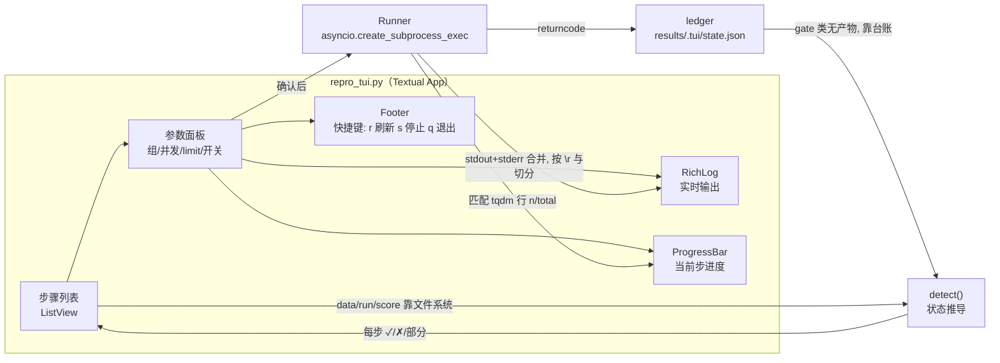

# repro_tui.py · 复刻流程傻瓜式 TUI

## Context

项目复刻链路共 9 步、跨 7 个脚本，README 里是一长串 `for G in O1 A1; do ...; done`。对不熟悉的人有三个门槛：

1. **顺序与前提隐式**：先 env 再数据再 gate0/1/2，跳步报错信息不直观（例如没数据时 gate1 大面积 FAIL）。
2. **易踩的坑不在界面上**：`--limit` 不带 `--out` 会一题不跑、并发不调慢到 15 分钟、
   `data/` 多一层直接 FileNotFoundError。
3. **花钱不可见**：跑三组约 ¥6.9，但命令里完全看不出来。

目标：一个全屏 TUI，**启动即显示 9 步各自的完成状态与下一步按钮**，点一下就跑，
实时滚日志，危险操作弹确认。选型 **Textual**（用户已确认），范围**全流程都包**（用户已确认）。

### 已核实的事实（本计划的前提，全部实测）

| 事实 | 值 / 说明 |
| --- | --- |
| `gate1_check.py` 退出码 | `1 if failed else 0`，无参数 |
| `gate0_check.py` 退出码 | 用 `assert`，失败抛异常（退出码 1）；**无参数**；落盘 `results/env.json` |
| `gate2_check.py` 参数 | **非 argparse**，`"--offline" in sys.argv`；退出码 `1 if failed else 0` |
| `run.py` 参数 | `--group {O1,O3,A1}` 必填；`--limit`、`--concurrency`、`--out`；产物 `results/<out or group>.jsonl` |
| `score.py` 参数 | `--group` 必填；`--out` 指**输入**文件名；产物 `results/<name>_scored.jsonl` |
| `paired.py` 参数 | 位置参数两个 jsonl；**无 `--out`**，结果只打 stdout |
| `analyze.py` 参数 | `--results-dir`（默认 `results/repro3`，不存在才回退 `results`）、`--out`、`--no-exk`、`--cases` |
| `fetch_data.py` | 已有：`--force` / `--keep-zip` / `--redownload`，幂等 |
| 全量行数基准 | 每组 `<G>.jsonl` 与 `<G>_scored.jsonl` 各 **500** 行 |
| 成本（README 口径） | O1 ≈ ¥0.4 / O3 ≈ ¥1.2 / A1 ≈ ¥5.3，三组 ≈ ¥6.9 |
| tqdm 行为 | **管道下不会自动静默**（实测 `disable=False` 且 `stderr_isatty=False`），必须自己处理 `\r` |
| textual 版本 | 清华镜像最新 **8.2.8**（计划钉此版本） |

## 整体架构 / 流程



### 九个步骤与完成判据

| # | 步骤 | 判据（能读文件就读文件，读不到才查台账） | 命令 |
| --- | --- | --- | --- |
| 1 | 环境 | `import openai, sqlglot, pandas, tqdm, textual` 全成功 | — |
| 2 | 密钥 | `.env` 含非空 `DEEPSEEK_API_KEY`（**只显示掩码**，不显示值） | — |
| 3 | 数据 | `data/dev_databases` 有 11 库目录 + 11 个 `*.sqlite` + `data/` 4 个小文件 | `fetch_data.py` |
| 4 | Gate 1 | 台账退出码 0（无产物） | `gate1_check.py` |
| 5 | Gate 0 | `results/env.json` 存在 **且** 台账退出码 0 | `gate0_check.py` |
| 6 | Gate 2 | 台账退出码 0（离线/完整各记一次） | `gate2_check.py [--offline]` |
| 7 | 跑组 | `results/<G>.jsonl` 行数 == 500（有 `--limit` 时 == limit） | `run.py --group G --concurrency N` |
| 8 | 判分 | `results/<G>_scored.jsonl` 行数 == 500 | `score.py --group G` |
| 9 | 配对 / 分析 | `results/.tui/paired_<A>_<B>.txt` 与 `results/analyze.md` 存在 | `paired.py A B`；`analyze.py --results-dir results --out results/analyze.md` |

> **状态原则**：有产物的步骤（3/5/7/8/9）**一律以文件系统为准**，TUI 不自己记；只有
> gate1/gate2 这类"无产物"的步骤才查 TUI 台账。台账只是补充，不是事实源——删掉
> `results/.tui/` 只会让 gate 类步骤显示"未运行"，不会误报其它步骤。

## 改动清单

### 新增 `repro_tui.py`（仓库根，约 450 行）

| 模块块 | 内容 |
| --- | --- |
| `Config` | 复用 `import config`，不硬编码路径；常量表 `STEPS` / `GROUP_COST` / `FULL_ROWS = 500` |
| `detect()` | 纯函数，返回 `list[StepStatus]`；`--check` 模式复用它打表后退出 |
| `Ledger` | 读写 `results/.tui/state.json`（`{step: {code, at, cmd}}`），只由 Runner 写 |
| `run_child()` | `asyncio.create_subprocess_exec(sys.executable, "-u", ...)`，`stdout=PIPE, stderr=STDOUT`，`PYTHONUNBUFFERED=1` |
| `iter_lines()` | 按 `\r` **和** `\n` 切分的读取器（tqdm 必须），`RE_TQDM = r"(\d+)/(\d+)"` 提取进度 |
| `ConfirmScreen` | `ModalScreen`：危险操作确认（跑组报成本、`--force` 重建数据） |
| `ReproApp` | 布局 + 绑定 + `run_worker`；`action_stop()` 先 `terminate()` 再兜底 `kill()` |
| `--check` | 非交互模式：打印步骤状态表 + 退出码，**不启动 TUI、不花钱**（给验证和 CI 用） |
| `非 tty 守卫` | `sys.stdin.isatty()` 为假时拒绝启动 TUI，提示改用 `--check` 或命令行脚本 |

CLI：

```bash
python repro_tui.py            # 启动 TUI
python repro_tui.py --check    # 非交互：打印 9 步状态表后退出（验证/CI 用）
```

### 运行期产物

| 路径 | 说明 |
| --- | --- |
| `results/.tui/state.json` | gate 类步骤的退出码台账 |
| `results/.tui/paired_O1_A1.txt` 等 | 配对检验输出留存（paired.py 无 `--out`，TUI 重定向） |
| `results/analyze.md` | `analyze.py --out` 的阶段 8 产出 |

`results/` 已被 `.gitignore` 屏蔽，这些产物不会污染版本库。

## 主要改动文件

| 文件 | 改动 |
| --- | --- |
| `repro_tui.py` | **新增** |
| `plan/repro-tui-plan.md` | 本计划文件 |

**不改动任何既有脚本**（`run.py` / `score.py` / `paired.py` / `gate*.py` / `fetch_data.py` 全部只被调用）。
**唯一的环境改动**：向 `db_agent` 环境 `pip install textual==8.2.8`（+ rich 依赖）。

## 验证

按执行规范，**视觉与交互验证由你在真实终端里做**，我只跑不花钱的非交互检查。

| # | 谁跑 | 命令 | 期望 |
| --- | --- | --- | --- |
| 1 | 我 | `python -c "import textual; print(textual.__version__)"` | `8.2.8` |
| 2 | 我 | `python repro_tui.py --check` | 打印 9 步状态表；当前应显示「环境 ✅ / 密钥 ✅ / 数据 ✗ / 后续 ⬜」；退出码 0 |
| 3 | 我 | `python -m py_compile repro_tui.py` | 通过 |
| 4 | **你** | `python repro_tui.py` | 全屏启动：左侧 9 步带状态图标、右侧日志面板、底部快捷键栏；`q` 能退出且**终端恢复正常**（不留 raw 模式后遗症） |
| 5 | **你** | 在 TUI 里点「数据」步骤 | 弹确认后跑 `fetch_data.py`，日志面板实时滚出 `[解压] …`，进度条随 `1.4G` 前进 |
| 6 | **你** | 选中 A1 点「跑组」 | **先弹成本确认**（约 ¥5.3）；确认后日志出现 tqdm 进度且**不出现挤成一行的乱码**（`\r` 切分生效） |
| 7 | **你** | 跑到一半按 `s` | 子进程被终止；再按 `r` 刷新，已写盘的 jsonl 行数被正确识别为"部分完成"，重跑走断点续跑 |
| 8 | **你** | 在非 tty 下 `python repro_tui.py \| cat` | 拒绝启动并给出提示（不是崩溃或卡死） |
| 9 | 我 | `python gate1_check.py` | 仍全 PASS（确认 TUI 没破坏既有链路） |

## 明确不做（后续再说）

- **不做自动化 UI 测试**：Textual 的 snapshot/单元测试成本高；改用 `--check` 模式覆盖
  状态推导逻辑（这是唯一有真实分支的部分），UI 由人工验收清单覆盖。
- **不做历史结果曲线**：`analyze.py` 已产出 EX@k 与成本表，TUI 只负责把它落盘并显示。
- **不改 `run.py` / `paired.py` 的接口**：例如给 `paired.py` 加 `--out` 更优雅，但那属于
  改实验代码，会牵动"基线冻结"的可比性审查，本次不碰。
- **不做环境自举**：TUI 不负责 `conda create` / `pip install` 依赖，只在缺失时给出可复制
  的安装命令。
- **不改 `README.md`**：README 里"O3 未跑全量"是过期描述（实际已全量跑完），属另一件事。
- **不做打包 / 发布 / 多机远程**。
